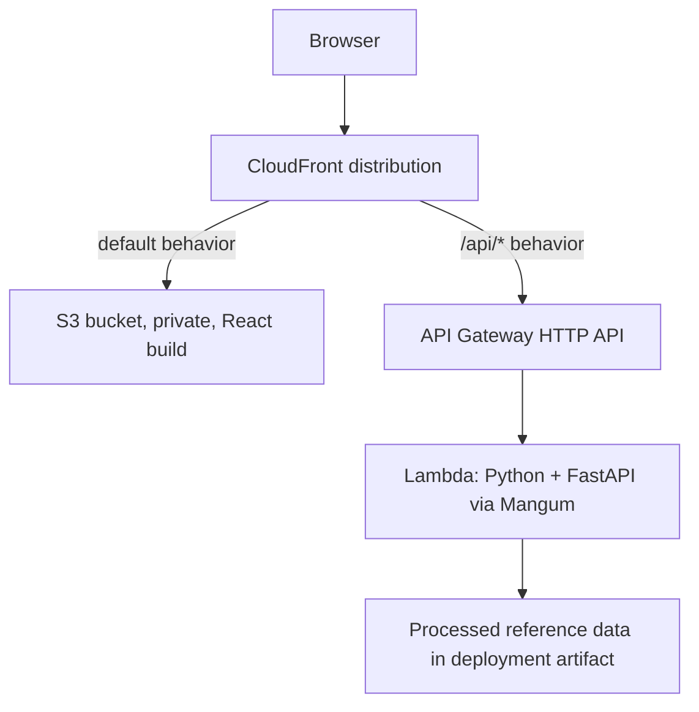

# Deployment

This document is the authoritative deployment sequence for the MTG Commander
Recommender MVP. Phase 1 is complete; no AWS stack has been deployed.

Read this file first. Open the supporting document linked by a phase only when
working on that topic:

- [Security and cost controls](deployment/security-and-costs.md) for scratch
  uploads, throttling, alarms, budgets, and exposure estimates
- [Reference data](deployment/reference-data.md) for Lambda packaging,
  versioned S3 staging, manifests, and CI acquisition
- [Cold starts](deployment/cold-starts.md) for initialization measurement,
  memory tuning, deserialization, and deferred SnapStart analysis

`docs/architecture.md` describes the currently implemented local application.
This document supersedes the target-topology sketch in `README.md`.

## Target Topology



CloudFront fronts both the static frontend and the API:

- the production frontend uses relative `/api` URLs
- API traffic is same-origin and does not require browser CORS
- the S3 frontend bucket remains private behind Origin Access Control
- static assets can be compressed by CloudFront
- API response compression is handled by FastAPI `GZipMiddleware`

The conditional presigned-upload branch introduces direct browser-to-S3
traffic and therefore requires scratch-bucket CORS. See Phase 0b and the
[security guide](deployment/security-and-costs.md).

### `/api` Prefix

CloudFront forwards `/api/config` and `/api/recommendations`, while FastAPI
currently exposes `/config` and `/recommendations`. The prefix must be removed
before routing reaches FastAPI.

Options, in preference order:

1. CloudFront Function on the `/api/*` viewer-request behavior
2. Mangum `api_gateway_base_path`
3. environment-driven FastAPI router prefix

CloudFront Function is recommended, but the choice remains open until Phase
4. Do not deploy the API behavior without an explicit prefix test.

## Decisions

| Area | Decision |
| --- | --- |
| API | API Gateway HTTP API v2 |
| Compute | Python 3.12+ Lambda on arm64 |
| Adapter | Mangum alongside the existing FastAPI ASGI app |
| Packaging | Zip artifact; full package size still requires measurement |
| Reference data | Processed JSON baked into the artifact |
| CI data source | Versioned private S3 archive identified by a committed manifest |
| Initialization | Keep lazy loading for the initial MVP |
| Frontend | Private S3 bucket behind CloudFront OAC |
| API path | `/api/*` through the same CloudFront distribution |
| Concurrency | Reserved concurrency 5 |
| Timeout | 10 seconds initially |
| DynamoDB | Not used in the MVP |
| WAF and custom domain | Deferred |
| SnapStart | Deferred and disabled |

## Phase Order

Complete each checkpoint before beginning the next phase. Phase 0b is a branch
from Phase 0, not a later enhancement. If its condition is met, change the API
contract before Phase 1.

## Phase 0: Required Measurements — Provisionally Resolved

### 1. Reference Data and Artifact Estimate — Provisionally Resolved

The four files in `data/processed` total **31,469,912 bytes / 30.01 MiB**.
This confirms that the reference-data portion fits the Lambda unzipped package
limit.

Current backend and script source files add approximately **76 KB**, while the
installed packages representing the expected Lambda runtime dependencies add
approximately **13.75 MiB** before Mangum. The resulting preliminary
uncompressed estimate is approximately **43.84 MiB**. This is comfortably
below Lambda's 250 MB uncompressed limit, but it is not the final artifact:
record both compressed and uncompressed sizes after Phase 1 defines the
focused dependency set and builds Linux arm64 packages. See the
[reference-data guide](deployment/reference-data.md).

### 2. Structurally Realistic 20,000-Row Export — Provisionally Resolved

`scripts/generate_test_collection.py` generated a 20,000-row CSV using the
Moxfield export schema and card names from the processed reference data. The
result was **1,456,947 bytes / 1.39 MiB / 72.8 bytes per row**, approximately
3.0 times below the effective raw-upload ceiling. This is stronger evidence
than the earlier compact QA fixture but remains synthetic; verify a genuine
verbose Moxfield, Archidekt, or ManaBox export before manual deployment.

The synchronous path is constrained by:

```text
API Gateway HTTP API body cap             10 MB
Lambda synchronous invocation payload      6,291,456 bytes
base64 inflation of multipart data          approximately 33%
API Gateway event-envelope overhead         variable
effective raw CSV ceiling                   approximately 4.4 MB
```

Proceed into Phase 1 using the synchronous upload branch provisionally. If a
later genuine export exceeds the effective ceiling, choose between lowering
the product's row limit and implementing Phase 0b. This is a product decision.

### 3. Maximum Response — Provisionally Resolved

A successful local request using the generated collection returned 20
recommendations, 66 theme-support groups, and 330 supporting-card examples.
The response measured **140,842 bytes uncompressed** and **12,248 bytes** when
compressed directly with gzip. This is not the absolute maximum response
shape and does not verify middleware behavior. Repeat the measurement after
Phase 1 adds `GZipMiddleware`, using the largest available response fixture.

**Checkpoint:** Phase 1 may begin with the synchronous upload branch. Before
Phase 2, record the final Linux arm64 artifact sizes, verify response
compression through the middleware, and test a genuine verbose export. If any
measurement invalidates the provisional conclusions, revisit the upload
branch before manual deployment.

## Phase 0b: Conditional Presigned S3 Upload

Implement this phase only if genuine exports cannot reliably fit the
synchronous Lambda payload.

The branch changes the flow to:

1. request a short-lived presigned POST form
2. upload the CSV directly to a private scratch bucket
3. submit the server-issued object key to `/recommendations`
4. process and delete the object immediately

Required controls include random server-generated keys, upload-size policy,
`HeadObject` validation, scratch-bucket CORS, route throttling, restricted IAM,
deletion in `finally`, and a one-day orphan-cleanup lifecycle rule. The full
requirements are in the
[security guide](deployment/security-and-costs.md#conditional-scratch-upload-security).

When this branch is selected:

- Phase 1 implements presign and object-key requests instead of multipart-only
  submission.
- `/config` exposes the selected S3 upload limit rather than automatically
  adopting 4 MiB.
- local tests use an S3 test double for key, size, and deletion behavior.
- Phase 2 performs the first full browser-to-S3 integration test.
- later end-to-end checkpoints verify CORS and orphan cleanup.

This API-contract change requires its own review before implementation.

## Phase 1: Deployment Application Changes — Complete

### Backend

- Add `handler = Mangum(app)` while retaining Uvicorn compatibility.
- Add Mangum to local and Lambda runtime dependencies.
- Create a Lambda-specific dependency definition; do not package every local,
  test, and processing dependency. See the
  [reference-data guide](deployment/reference-data.md#lambda-runtime-dependencies).
- Add environment-driven configuration:
  - `REFERENCE_DATA_DIR`, defaulting to packaged `data/processed`
  - `ALLOWED_ORIGINS`, retaining local Vite origins for development
  - `MAX_UPLOAD_BYTES`
- On the synchronous branch, adopt 4 MiB only if Phase 0 confirms it supports
  genuine exports.
- Add `GZipMiddleware`.
- Instrument reference-data load time explicitly inside the first request.
- Keep lazy reference-data loading.
- Pin the deployment runtime to Python 3.12 or later.

### Frontend

- Replace the hardcoded localhost API URL with `VITE_API_BASE_URL` and use
  `/api` for production.
- Add a Vite development proxy so local requests also use `/api`.
- Add `AbortController` cancellation without automatic retry.
- If Phase 0b is selected, implement the presign, S3 upload, and object-key
  sequence through the existing loading/error/results state machine.

### Local Lambda Verification

Create a minimal SAM template for local invocation. It contains only the API
function and events and is superseded by CDK in Phase 5.

```powershell
sam build --use-container
sam local start-api
```

On the synchronous branch, verify a real multipart upload through SAM. On the
S3 branch, verify presigning, key validation, size rejection, and guaranteed
deletion with an S3 test double.

### Verified Local SAM Results — August 7, 2026

- The Python 3.12 arm64 image ran through Docker on an x86_64 Windows host.
- `/recommendations` returned HTTP 200 with 20 results; `/config` returned the
  4 MiB limit; gzip reduced the response from about 143 KB to 11,157 bytes.
- The first handler invocation took **9,944.72 ms**. Reference-data misses
  accounted for **2,231.14 ms**; runtime initialization was **2.57 ms**.
- The cached invocation took **700.30 ms**, about **14.2 times faster**;
  reference-data cache hits each took 0.01–0.02 ms.
- Local client totals were 11.03 seconds and 1.75 seconds. Real Lambda latency,
  memory use, and the 10-second default timeout still require Phase 2 review.

### Current Phase 1 Status

Implemented: the Mangum handler, focused Lambda build, Python 3.12 arm64
runtime, environment-driven backend settings, 4 MiB upload limit,
`GZipMiddleware`, cache-aware reference-load timing, relative `/api` frontend
configuration, Vite development proxy, and abortable requests without
automatic retries. README and agent guidance are aligned with these changes.

Validation: all 107 backend tests and 6 frontend tests pass; frontend lint,
production build, rebuilt SAM artifact, multipart upload, gzip, configuration,
and cache instrumentation are verified.

**Checkpoint: Complete.** The synchronous upload branch passes local API and
regression tests through a Lambda-compatible handler.

## Phase 2: Manual Backend Deployment

Deploy once manually to understand the resources that CDK will later define.

- Build runtime dependencies as Linux `aarch64` wheels using the command in
  the [reference-data guide](deployment/reference-data.md#lambda-runtime-dependencies).
- Start with 1,024 MB memory, a 10-second timeout, and reserved concurrency 5.
- Create an API Gateway HTTP API Lambda proxy integration.
- Configure route throttling at 10 requests/second with burst 20.
- Use the corrected local CSV path `data/raw/test_collection.csv` for the
  synchronous verification request.
- On Phase 0b, run the complete live presign, upload, recommendation, and
  deletion flow instead.
- Record explicit reference-load timing; do not treat Lambda `Init Duration`
  as reference-data load time.

**Checkpoint:** recommendations return from the API Gateway URL, the selected
upload flow works, and cold/warm timings are recorded.

## Phase 3: Frontend Hosting

- Create a private S3 bucket with static website hosting disabled.
- Grant CloudFront access through Origin Access Control.
- Set `index.html` as the default root object.
- Do not map distribution-wide 403 or 404 responses to `index.html`; that
  would also replace API-origin errors with frontend HTML.
- The current frontend has no client-side routes and needs no SPA fallback.
  If routing is added later, use a viewer-request rewrite associated only with
  the default S3 behavior.
- Cache content-hashed assets with `max-age=31536000, immutable`.
- Serve `index.html` with `no-cache`.
- Use CloudFront price class 100 initially.

**Checkpoint:** the frontend loads from the CloudFront URL and static assets
remain private at the S3 origin.

## Phase 4: Single-Origin API Wiring

Add API Gateway as the `/api/*` CloudFront origin.

| Setting | Value |
| --- | --- |
| Allowed methods | GET, HEAD, OPTIONS, PUT, POST, PATCH, DELETE |
| Cache policy | `CachingDisabled` |
| Origin request policy | `AllViewerExceptHostHeader` |
| Prefix handling | Explicitly selected and tested `/api` stripping mechanism |

Point the frontend at `/api`. Keep backend origin configuration for local
development, but production API traffic should remain same-origin.

**Checkpoint:** the browser completes the full selected upload flow through
CloudFront, including structured 400, 413, and 422 responses. If Phase 0b is
active, also verify scratch-bucket CORS and cleanup.

## Phase 5: Infrastructure as Code

Replace manually created resources with AWS CDK in Python. Define Lambda, API
Gateway, S3, CloudFront, OAC, throttling, log retention, and IAM explicitly.

CDK stages large zip assets through its bootstrap bucket, bypassing the 50 MB
direct-upload limit but not Lambda's 250 MB uncompressed limit.

A reference-data Lambda layer remains optional and should be introduced only
if its separate release cadence is worth the added version management. Layers
do not increase the combined uncompressed package limit.

**Checkpoint:** `cdk deploy` recreates the verified manual stack, and SAM can
invoke the synthesized Lambda definition locally.

## Phase 6: Operational Guardrails

Implement the controls in
[Security and Cost Controls](deployment/security-and-costs.md):

- reserved concurrency and timeout
- API route throttling
- Lambda and API Gateway alarms
- SNS notifications
- automated and manual concurrency-zero kill switches
- AWS Budget and Cost Anomaly Detection
- 14-day log retention

**Checkpoint:** notifications reach the owner, the remediation Lambda can
disable the API function, and the manual kill switch has been tested.

## Phase 7: Cold-Start Tuning

Follow the [cold-start guide](deployment/cold-starts.md):

1. measure explicit reference loading separately from Lambda initialization
2. compare memory settings
3. evaluate faster deserialization only if measurements justify it
4. keep SnapStart disabled

SnapStart requires eager reference-data initialization and is reconsidered
only after deployed measurements, compatibility confirmation, and automated
version cleanup.

**Checkpoint:** deployed cold and warm latency meet the MVP target, or the
remaining limitation and accepted tradeoff are documented.

## Phase 8: CI/CD and Reference-Data Staging

Implement the workflow in the
[reference-data guide](deployment/reference-data.md#ci-pipeline):

- GitHub Actions authenticates through AWS OIDC.
- A committed manifest identifies the exact private S3 reference archive.
- CI downloads and verifies the archive checksum.
- CI builds Linux arm64 dependencies and records artifact sizes.
- The backend job runs tests and `cdk deploy`.
- The frontend job runs tests and build, synchronizes to S3, and invalidates
  `/index.html`.
- If SnapStart is ever adopted, CI removes superseded published versions.

**Checkpoint:** the same commit and manifest reproduce the same deployment
artifact without downloading changing Scryfall data during the build.

## Required Documentation Updates

Apply these changes as their corresponding phases land:

| Document | Update | Phase |
| --- | --- | --- |
| `README.md` upload limit | Replace 5 MiB if a different final limit is selected | 1 |
| `README.md` curl example | Change `data/test_collection.csv` to `data/raw/test_collection.csv` | 1 |
| `README.md` API contract | Document presign and object-key flow if Phase 0b is selected | 0b |
| `README.md` tech stack | Remove DynamoDB from active MVP stack | 1 |
| `README.md` topology | Add CloudFront and link to this document | 4 |
| `docs/architecture.md` | Point target deployment references to this document | 4 |
| `docs/architecture.md` request pipeline | Document temporary S3 handling if Phase 0b is selected | 0b |
| `agent.md` | Add cancellation and no-retry deployment rules | 1 |

## Open Questions

1. What is the byte size of a genuine verbose 20,000-row export?
2. What is the largest successful recommendation response before and after
   compression?
3. What are the complete compressed and uncompressed Lambda artifact sizes?
4. If synchronous uploads cannot support 20,000 rows, should the product lower
   the row limit or adopt Phase 0b?
5. What is the final upload-size limit?
6. Which AWS Region will host the stack?
7. Which `/api` prefix mechanism will be used?
8. Which AWS account plan is active?
9. If SnapStart is reconsidered, does the selected Python runtime support it
   on arm64 in the chosen Region?
