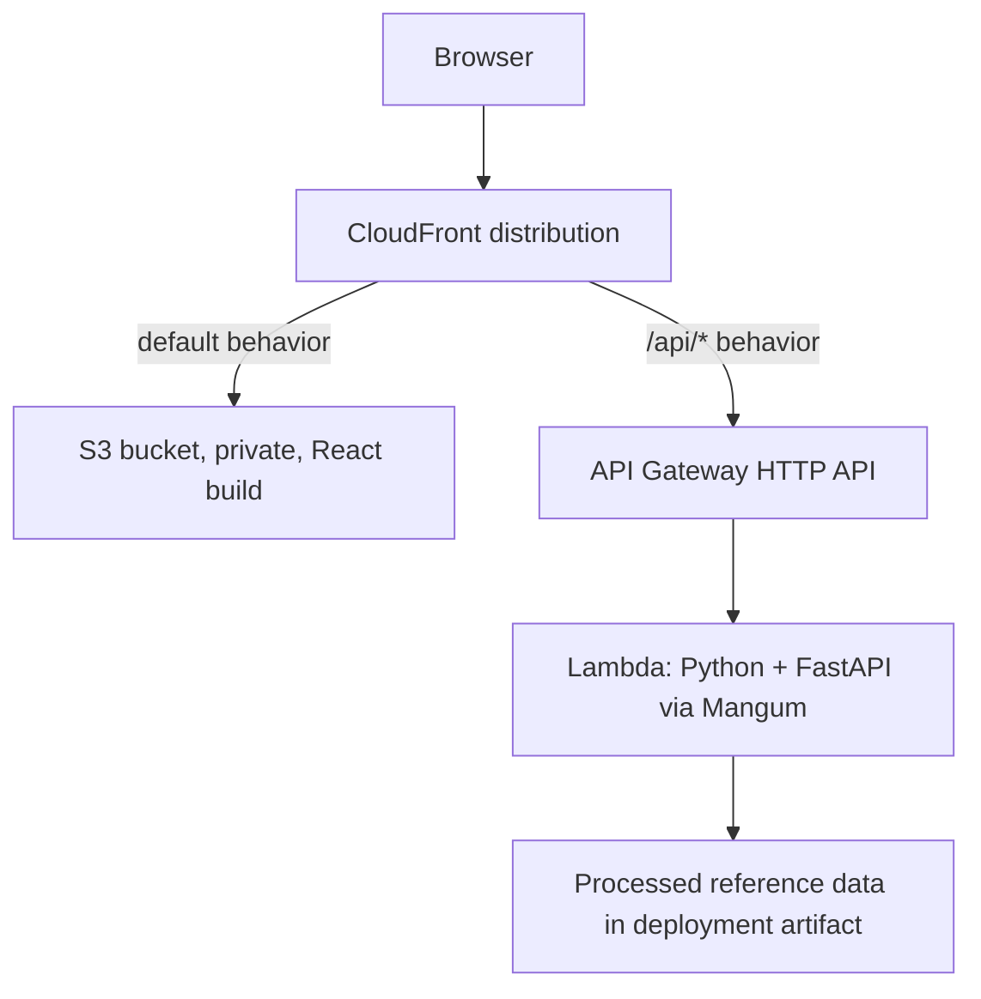

# Deployment

This document is the authoritative deployment sequence for the MTG Commander
Recommender MVP. Phases 1 through 5 are complete; the backend, private frontend,
and single-origin CloudFront routing are deployed through the Python CDK stack
`commander-rec-cdk` in `us-west-1`.

Read this file first. Open the supporting document linked by a phase only when
working on that topic:

- [Security and cost controls](deployment/security-and-costs.md) for scratch
  uploads, throttling, alarms, budgets, and exposure estimates
- [Reference data](deployment/reference-data.md) for Lambda packaging,
  versioned S3 staging, manifests, and CI acquisition
- [Cold starts](deployment/cold-starts.md) for initialization measurement,
  memory tuning, deserialization, and deferred SnapStart analysis

`docs/architecture.md` describes the currently implemented local application.
This document supersedes the target-topology sketch in `README.md`.

## Target Topology



CloudFront fronts both the static frontend and the API:

- the production frontend uses relative `/api` URLs
- API traffic is same-origin and does not require browser CORS
- the S3 frontend bucket remains private behind Origin Access Control
- static assets can be compressed by CloudFront
- API response compression is handled by FastAPI `GZipMiddleware`

The conditional presigned-upload branch introduces direct browser-to-S3
traffic and therefore requires scratch-bucket CORS. See Phase 0b and the
[security guide](deployment/security-and-costs.md).

### `/api` Prefix

CloudFront forwards `/api/config` and `/api/recommendations`, while FastAPI
exposes `/config` and `/recommendations`. The published viewer-request function
`commander-rec-cdk-strip-api-prefix` removes `/api` on the `/api/*` behavior
before the request reaches API Gateway. Explicit function tests and live
requests confirmed `/api/config` becomes `/config` without changing the
selected origin.

## Decisions

| Area | Decision |
| --- | --- |
| API | API Gateway HTTP API v2 |
| Compute | Python 3.12+ Lambda on arm64 |
| Adapter | Mangum alongside the existing FastAPI ASGI app |
| Packaging | Zip artifact; full package size still requires measurement |
| Reference data | Processed JSON baked into the artifact |
| CI data source | Versioned private S3 archive identified by a committed manifest |
| Initialization | Keep lazy loading for the initial MVP |
| Frontend | Private S3 bucket behind CloudFront OAC |
| API path | `/api/*` through the same CloudFront distribution |
| Concurrency | API throttle 10 requests/second, burst 20; reserved concurrency deferred |
| Timeout | 10 seconds initially |
| DynamoDB | Not used in the MVP |
| WAF and custom domain | Deferred |
| SnapStart | Deferred and disabled |

## Phase Order

Complete each checkpoint before beginning the next phase. Phase 0b is a branch
from Phase 0, not a later enhancement. If its condition is met, change the API
contract before Phase 1.

## Phase 0: Required Measurements — Provisionally Resolved

### 1. Reference Data and Artifact Estimate — Provisionally Resolved

The four files in `data/processed` total **31,469,912 bytes / 30.01 MiB**.
This confirms that the reference-data portion fits the Lambda unzipped package
limit.

Current backend and script source files add approximately **76 KB**, while the
installed packages representing the expected Lambda runtime dependencies add
approximately **13.75 MiB** before Mangum. The resulting preliminary
uncompressed estimate is approximately **43.84 MiB**. This is comfortably
below Lambda's 250 MB uncompressed limit, but it is not the final artifact:
record both compressed and uncompressed sizes after Phase 1 defines the
focused dependency set and builds Linux arm64 packages. See the
[reference-data guide](deployment/reference-data.md).

### 2. Structurally Realistic 20,000-Row Export — Provisionally Resolved

`scripts/generate_test_collection.py` generated a 20,000-row CSV using the
Moxfield export schema and card names from the processed reference data. The
result was **1,456,947 bytes / 1.39 MiB / 72.8 bytes per row**, approximately
3.0 times below the effective raw-upload ceiling. This is stronger evidence
than the earlier compact QA fixture but remains synthetic; verify a genuine
verbose Moxfield, Archidekt, or ManaBox export before manual deployment.

The synchronous path is constrained by:

```text
API Gateway HTTP API body cap             10 MB
Lambda synchronous invocation payload      6,291,456 bytes
base64 inflation of multipart data          approximately 33%
API Gateway event-envelope overhead         variable
effective raw CSV ceiling                   approximately 4.4 MB
```

Proceed into Phase 1 using the synchronous upload branch provisionally. If a
later genuine export exceeds the effective ceiling, choose between lowering
the product's row limit and implementing Phase 0b. This is a product decision.

### 3. Maximum Response — Provisionally Resolved

A successful local request using the generated collection returned 20
recommendations, 66 theme-support groups, and 330 supporting-card examples.
The response measured **140,842 bytes uncompressed** and **12,248 bytes** when
compressed directly with gzip. This is not the absolute maximum response
shape and does not verify middleware behavior. Repeat the measurement after
Phase 1 adds `GZipMiddleware`, using the largest available response fixture.

**Checkpoint:** Phase 1 may begin with the synchronous upload branch. Before
Phase 2, record the final Linux arm64 artifact sizes, verify response
compression through the middleware, and test a genuine verbose export. If any
measurement invalidates the provisional conclusions, revisit the upload
branch before manual deployment.

## Phase 0b: Conditional Presigned S3 Upload

Implement this phase only if genuine exports cannot reliably fit the
synchronous Lambda payload.

The branch changes the flow to:

1. request a short-lived presigned POST form
2. upload the CSV directly to a private scratch bucket
3. submit the server-issued object key to `/recommendations`
4. process and delete the object immediately

Required controls include random server-generated keys, upload-size policy,
`HeadObject` validation, scratch-bucket CORS, route throttling, restricted IAM,
deletion in `finally`, and a one-day orphan-cleanup lifecycle rule. The full
requirements are in the
[security guide](deployment/security-and-costs.md#conditional-scratch-upload-security).

When this branch is selected:

- Phase 1 implements presign and object-key requests instead of multipart-only
  submission.
- `/config` exposes the selected S3 upload limit rather than automatically
  adopting 4 MiB.
- local tests use an S3 test double for key, size, and deletion behavior.
- Phase 2 performs the first full browser-to-S3 integration test.
- later end-to-end checkpoints verify CORS and orphan cleanup.

This API-contract change requires its own review before implementation.

## Phase 1: Deployment Application Changes — Complete

### Backend

- Add `handler = Mangum(app)` while retaining Uvicorn compatibility.
- Add Mangum to local and Lambda runtime dependencies.
- Create a Lambda-specific dependency definition; do not package every local,
  test, and processing dependency. See the
  [reference-data guide](deployment/reference-data.md#lambda-runtime-dependencies).
- Add environment-driven configuration:
  - `REFERENCE_DATA_DIR`, defaulting to packaged `data/processed`
  - `ALLOWED_ORIGINS`, retaining local Vite origins for development
  - `MAX_UPLOAD_BYTES`
- On the synchronous branch, adopt 4 MiB only if Phase 0 confirms it supports
  genuine exports.
- Add `GZipMiddleware`.
- Instrument reference-data load time explicitly inside the first request.
- Keep lazy reference-data loading.
- Pin the deployment runtime to Python 3.12 or later.

### Frontend

- Replace the hardcoded localhost API URL with `VITE_API_BASE_URL` and use
  `/api` for production.
- Add a Vite development proxy so local requests also use `/api`.
- Add `AbortController` cancellation without automatic retry.
- If Phase 0b is selected, implement the presign, S3 upload, and object-key
  sequence through the existing loading/error/results state machine.

### Local Lambda Verification

Create a minimal SAM template for local invocation. It contains only the API
function and events and is superseded by CDK in Phase 5.

```powershell
sam build --use-container
sam local start-api
```

On the synchronous branch, verify a real multipart upload through SAM. On the
S3 branch, verify presigning, key validation, size rejection, and guaranteed
deletion with an S3 test double.

### Verified Local SAM Results — August 7, 2026

- The Python 3.12 arm64 image ran through Docker on an x86_64 Windows host.
- `/recommendations` returned HTTP 200 with 20 results; `/config` returned the
  4 MiB limit; gzip reduced the response from about 143 KB to 11,157 bytes.
- The first handler invocation took **9,944.72 ms**. Reference-data misses
  accounted for **2,231.14 ms**; runtime initialization was **2.57 ms**.
- The cached invocation took **700.30 ms**, about **14.2 times faster**;
  reference-data cache hits each took 0.01–0.02 ms.
- Local client totals were 11.03 seconds and 1.75 seconds. Real Lambda latency,
  memory use, and the 10-second default timeout still require Phase 2 review.

### Current Phase 1 Status

Implemented: the Mangum handler, focused Lambda build, Python 3.12 arm64
runtime, environment-driven backend settings, 4 MiB upload limit,
`GZipMiddleware`, cache-aware reference-load timing, relative `/api` frontend
configuration, Vite development proxy, and abortable requests without
automatic retries. README and agent guidance are aligned with these changes.

Validation: all 107 backend tests and 6 frontend tests pass; frontend lint,
production build, rebuilt SAM artifact, multipart upload, gzip, configuration,
and cache instrumentation are verified.

**Checkpoint: Complete.** The synchronous upload branch passes local API and
regression tests through a Lambda-compatible handler.

## Phase 2: Manual Backend Deployment

**Status: Complete.** The Python 3.12 `arm64` artifact was deployed manually
through SAM and CloudFormation in `us-west-1` with 1,024 MB memory and a
10-second timeout. The HTTP API default stage was throttled to 10 requests per
second with burst 20. Reserved concurrency 5 was deferred because the account
concurrency quota is 10; the account limit and API throttle provide the test
deployment's safety bounds.

Both `data/raw/test_collection.csv` and
`data/raw/test_collection_realistic.csv` returned 20 recommendations through
API Gateway and the localhost frontend. The cold request took 3.179 seconds
end-to-end (977.13 ms Lambda initialization, 1,257.14 ms handler duration,
870.51 ms explicit reference loading); the warm request took 0.579 seconds
end-to-end (284.77 ms handler duration with reference-data cache hits). Peak
memory was 250 MB. Gzip reduced the response to 11,157 bytes, and cold/warm
response hashes were identical. `/config`, `/recommendations`, CORS, and the
browser upload flow all returned HTTP 200.

## Phase 3: Frontend Hosting

**Status: Complete.** The production Vite build is hosted in a private S3
bucket with static website hosting and public access disabled. A pay-as-you-go
CloudFront distribution uses signed Origin Access Control requests, the
default CloudFront certificate, `index.html` as its default root object,
`CachingOptimized`, automatic compression, and price class 100. WAF, custom
domains, and distribution-wide error rewrites remain disabled.

`index.html` is served with `no-cache`; content-hashed JavaScript, CSS, and
font assets use `public,max-age=31536000,immutable`. JavaScript metadata was
verified as `application/javascript`. CloudFront returned HTTP 200 for the
root, assets, favicon, and sample CSV, while direct S3 access returned HTTP
403 and a missing CloudFront path was not rewritten to `index.html`.

## Phase 4: Single-Origin API Wiring

**Status: Complete.** API Gateway is configured as the `/api/*` CloudFront
origin, with the following behavior:

| Setting | Value |
| --- | --- |
| Allowed methods | GET, HEAD, OPTIONS, PUT, POST, PATCH, DELETE |
| Cache policy | `CachingDisabled` |
| Origin request policy | `AllViewerExceptHostHeader` |
| Prefix handling | `commander-rec-cdk-strip-api-prefix` viewer-request function |

The production frontend uses relative `/api` requests while local development
retains its Vite proxy and localhost backend origins. The CloudFront behavior
returned HTTP 200 for `/api/config` and both test collections, with 20
recommendations for each. Gzip was verified after attaching
`AllViewerExceptHostHeader`; a representative response was reduced to 11,240
bytes. Structured 400, 413, and 422 responses passed through CloudFront with
the expected API error shape.

The browser completed the same-origin POST flow without CORS errors or direct
`execute-api` requests. The realistic collection completed in about four
seconds without browser network throttling, consistent with command-line
measurements.

**Checkpoint: Complete.** The synchronous browser upload flow works through
the single CloudFront origin.

## Phase 5: Infrastructure as Code

**Status: Complete.** The Python CDK app in `infra` defines Lambda, API Gateway,
S3, CloudFront, OAC, throttling, 14-day log retention, IAM, frontend deployment,
and cache policies. The separate `commander-rec-cdk` stack was synthesized,
tested, reviewed with `cdk diff`, and deployed successfully.

CDK stages large zip assets through its bootstrap bucket, bypassing the 50 MB
direct-upload limit but not Lambda's 250 MB uncompressed limit.

A reference-data Lambda layer remains optional and should be introduced only
if its separate release cadence is worth the added version management. Layers
do not increase the combined uncompressed package limit.

Both test collections returned HTTP 200 with 20 recommendations through the
CDK-managed CloudFront distribution. The standard collection completed in
1.74 seconds and the realistic collection in 4.81 seconds. Gzip reduced the
representative response to 11,240 bytes. Browser same-origin routing, the
10-request/second and burst-20 API throttle, frontend cache headers, and private
S3 access were verified. Warm Lambda work completed in 314.95 ms with 253 MB
peak memory; a lightweight request completed in 2.92 ms.

SAM invoked the synthesized ARM64 Lambda definition locally and returned HTTP
200 from `/config`; local x86-to-ARM emulation completed in 5.93 seconds. After
cutover, the superseded `commander-rec-phase2` stack and manually created S3,
CloudFront, and prefix-function resources were removed.

**Checkpoint: Complete.** `cdk deploy` recreates the verified architecture, and
SAM can invoke the synthesized Lambda definition locally.

## Phase 6: Operational Guardrails

Implement the controls in
[Security and Cost Controls](deployment/security-and-costs.md):

1. Keep the account concurrency quota at 10, the Lambda timeout at 10 seconds,
   and the API throttle at 10 requests/second with burst 20.
2. Create one SNS alert topic with a confirmed email subscription.
3. Add the seven Lambda and API Gateway alarms with conservative initial
   thresholds and non-breaching missing-data behavior.
4. Enable structured API Gateway access logs with 14-day retention, attach
   CloudFront's managed security headers, and disable production API docs.
5. Verify the existing `$1` and `$10` budgets, actual and forecast alerts, and
   AWS Cost Anomaly Detection notifications.
6. Deploy through CDK, test the SNS and alarm paths, and verify normal browser
   and CSV-upload behavior.
7. Test reserved concurrency zero during a planned window, restore service by
   deleting the concurrency configuration, and rerun the API checks.

Positive reserved concurrency and an automated remediation Lambda are deferred
for the low-traffic showcase deployment. The existing account concurrency
quota of 10 remains the regional blast-radius cap; increasing it solely to
reserve function capacity would add complexity without a current traffic need.

The controls were deployed through CDK. The SNS subscription was confirmed,
and both a direct publish and a temporary CloudWatch alarm-state test delivered
email notifications. All seven alarms target the topic. API Gateway access
logs contain operational metadata without upload contents and retain events for
14 days. CloudFront returns the managed security headers, while `/api/docs` and
`/api/openapi.json` return HTTP 404. The `$1` and `$10` budget notifications and
Cost Anomaly Detection are configured.

The manual kill-switch test returned HTTP 503 with reserved concurrency set to
zero. Deleting that configuration restored `/api/config` to HTTP 200 and
returned the function to the account's unreserved concurrency pool.

**Checkpoint: Complete.** Alerts reach the owner, logging and browser hardening
are verified, billing notifications are active, and the emergency kill switch
has been tested and safely restored.

## Phase 7: Cold-Start Tuning

**Status: Complete.** AWS Lambda Power Tuning compared 1,024, 1,536, 1,769,
and 2,048 MB with ten realistic-collection invocations per setting. At 1,769
MB, average duration was 2,035.25 ms and average invocation cost was
`$0.00004783`. Compared with 1,024 MB, this was 43.8% faster and 2.9% cheaper;
2,048 MB was slightly slower and 17% more expensive than 1,769 MB. CDK now
configures the ARM64 function at 1,769 MB while retaining the 10-second
timeout.

The first deployed request at the new setting recorded 1,202.05 ms of Lambda
initialization and 621.62 ms of explicit reference loading, followed by
2,685.67 ms of handler duration. The warm request completed in 1,918.73 ms
with reference-data cache hits. Peak memory was 262 MB, and logs contained
timing metadata without uploaded collection contents.

Cold and warm responses were byte-identical with SHA256
`B8A6BD3FBC951EB102C878846F88BFADDA0ADF014189C73E41C7E3B6B593C3B0`.
The deployed package size reported by Lambda was 12,083,894 bytes (11.53 MiB).
The measured latency meets the MVP target, so faster deserialization and
SnapStart remain deferred. The temporary Power Tuning stack and S3 payload
bucket were deleted after validation.

Follow the [cold-start guide](deployment/cold-starts.md):

1. measure explicit reference loading separately from Lambda initialization
2. compare memory settings
3. evaluate faster deserialization only if measurements justify it
4. keep SnapStart disabled

SnapStart requires eager reference-data initialization and is reconsidered
only after deployed measurements, compatibility confirmation, and automated
version cleanup.

**Checkpoint: Complete.** Deployed cold and warm latency meet the MVP target,
the selected memory setting is defined in CDK, and temporary tuning resources
have been removed.

## Phase 8: CI/CD and Reference-Data Staging

Implement the workflow in the
[reference-data guide](deployment/reference-data.md#ci-pipeline):

- GitHub Actions authenticates through AWS OIDC.
- A committed manifest identifies the exact private S3 reference archive.
- CI downloads and verifies the archive checksum.
- CI builds Linux arm64 dependencies and records artifact sizes.
- The backend job runs tests and `cdk deploy`.
- The frontend job runs tests and build, synchronizes to S3, and invalidates
  `/index.html`.
- If SnapStart is ever adopted, CI removes superseded published versions.

**Checkpoint:** the same commit and manifest reproduce the same deployment
artifact without downloading changing Scryfall data during the build.

## Required Documentation Updates

Apply these changes as their corresponding phases land:

| Document | Update | Phase | Status |
| --- | --- | --- | --- |
| `README.md` upload limit | Document the enforced 4 MiB limit | 1 | Complete |
| `README.md` curl example | Use `data/raw/test_collection.csv` | 1 | Complete |
| `README.md` API contract | Document presign and object-key flow | 0b | Not applicable |
| `README.md` tech stack | Remove DynamoDB from the active MVP | 1 | Complete |
| `README.md` topology | Add CloudFront and link to this document | 4 | Complete |
| `docs/architecture.md` | Point deployment references to this document | 4 | Complete |
| `docs/architecture.md` request pipeline | Document temporary S3 handling | 0b | Not applicable |
| `agent.md` | Add cancellation and no-retry deployment rules | 1 | Complete |

## Open Questions

1. What is the byte size of a genuine verbose 20,000-row export?
2. What is the largest successful recommendation response before and after
   compression?
3. What are the complete compressed and uncompressed Lambda artifact sizes?
4. If synchronous uploads cannot support 20,000 rows, should the product lower
   the row limit or adopt Phase 0b?
5. Which AWS account plan is active?
6. If SnapStart is reconsidered, does the selected Python runtime support it
   on arm64 in the chosen Region?
